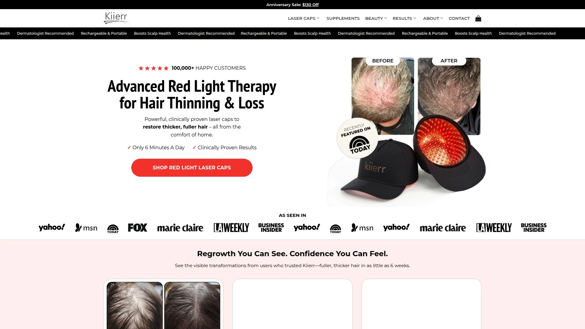
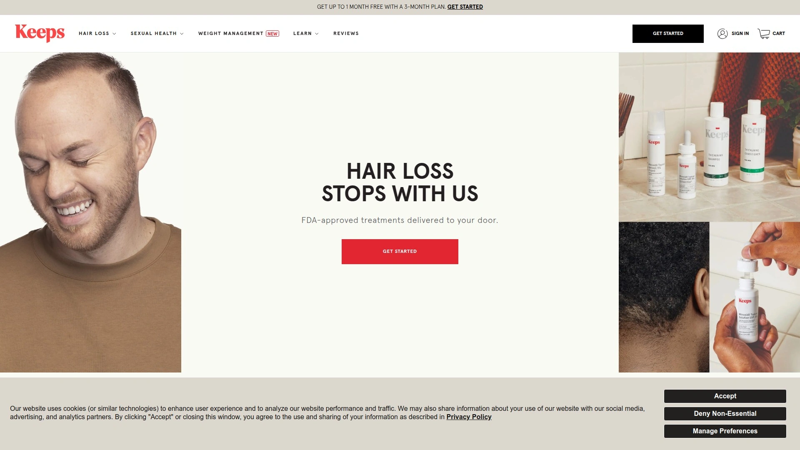

# 2025年排名前18的激光生发设备汇总（最新整理）

脱发困扰着全球数百万人，无论是遗传性雄激素脱发、产后脱发还是压力导致的发量减少，都让人倍感焦虑。传统药物治疗常伴随副作用，而植发手术费用高昂且恢复期长。近年来，FDA认证的低能量激光疗法（LLLT）设备为脱发人群提供了无创、无药物的家用解决方案。这些设备通过红光波长刺激毛囊细胞活性，改善头皮血液循环，让休眠期毛囊重新进入生长期。本文整理了18款市场认可度高、技术成熟的激光生发设备与配套治疗方案，帮助你根据脱发程度、预算与使用习惯，找到最适合的生发路径。

---

## **[iRESTORE](https://www.irestorelaser.com)**

FDA认证的专业级激光生发系统，适合中重度脱发人群快速见效。

iRESTORE采用独家Lumitech™技术，在临床研究中，100%的参与者在4个月内实现了不同程度的头发生长，平均增发率达43.2%。设备配备282个医疗级激光二极管，覆盖全头皮，每次治疗仅需25分钟。Elite旗舰款功率更强，特别适合发际线后退、头顶稀疏等重度脱发场景。品牌已服务超50万用户，获得29,000+真实评价，且提供180天满意度保证。产品线还包括Advanced配方生发精华液，可与设备协同使用，加速毛囊修复。设备轻便可充电，边看剧边治疗，无需固定姿势。目前精选设备享受最高700美元折扣，性价比突出。

***

## **[HairMax](https://hairmax.com)**

全球激光生发领域临床研究最多的品牌，拥有7项FDA认证。

HairMax是首个获FDA批准的家用激光生发设备品牌（早于2007年），至今已积累超过20年临床数据。LaserBand系列采用柔性设计，贴合头皮曲线，确保激光能量均匀渗透。82激光单元的Comfort Flex款适合早期脱发预防，272单元的专业版则针对大面积稀疏。每周仅需使用3次，每次90秒至15分钟不等。品牌还推出便携式梳状设备，出差旅行也能坚持疗程。用户反馈显示，12-16周可见发量增加，6个月效果显著。HairMax配套APP可记录治疗进度并推送提醒，帮助建立长期护理习惯。

***

## **[LaserCap](https://lasercap.com)**

医疗机构同款处方级激光帽，能量密度行业领先。

LaserCap是最早的激光生发帽发明者，设备在美国工厂手工组装，质量管控严格。HD+旗舰款搭载304个激光二极管，能量密度高达3.93 J/cm²，是市场上功率最强的激光帽，适合晚期脱发与全头皮治疗需求。设备采用脉冲光技术，模拟毛囊自然生长节律，比持续光照更高效。全球2,500+植发诊所指定使用，获发际线重建专家Alan Bauman博士背书。标准款80激光单元适合预防期，224单元HD款平衡性价比与疗效。每次治疗30分钟，帽檐设计可遮挡红光，保护眼睛。设备支持无线充电，彻底解决线缆束缚。

***

## **[Theradome](https://theradome.com)**

100%激光技术零LED，98%用户满意度的临床级头盔。

Theradome坚持使用纯激光二极管，拒绝掺杂廉价LED灯珠，确保每束光都能深入毛囊基底层。设备曾是专业诊所专用设备，现开放家用版本。80个定制激光单元采用特殊波长组合，穿透力比普通红光强40%。全球57个国家、累计1亿次治疗记录验证其安全性。头盔式设计完全贴合头型，无需手持或调整位置，可边做家务边治疗。每周使用2次，每次20分钟，6个月疗程后发量可增加30-50%。品牌提供180天退货政策，打消初次尝试者的顾虑。Theradome还针对女性产后脱发推出专项治疗方案。

***

## **[Capillus](https://www.capillus.com)**

超轻薄可穿戴设计，商务人士与上班族首选。

Capillus将激光设备做到棒球帽般轻薄，重量不足200克，戴着外出也不会引起注意。82到272不等的激光单元覆盖不同预算，即便入门款也能实现均匀照射。设备内置蓝牙模块，通过手机APP监控每次治疗时长与疗程进度，数据可同步至云端分享给医生。临床试验显示，17周内头发密度平均提升51%。Capillus特别优化了发际线区域的激光分布，对M型脱发效果明显。每次仅需6分钟，适合时间紧张的职场人群。设备可USB充电，一次充满可用一周。

***

## **[Kiierr](https://kiierr.com)**

高性价比激光帽代表，FDA认证下沉市场的亲民选择。

Kiierr主打性价比路线，148激光单元的Pro款售价约600美元，比同级产品便宜30%以上。272单元的Premier款功率达1360mW，覆盖面积与千元级产品相当。设备提供7年质保（行业平均2年），且承诺终身客户支持。每次治疗30分钟，隔天使用即可。用户反馈显示，3个月脱发减少，6个月可见新发茬。Kiierr还赠送生发喷雾与头皮按摩梳，组合使用效果更佳。设备采用可拆卸内衬设计，方便清洗保持卫生。品牌推出210天超长试用期，让用户有充足时间评估效果。

***

## **[Illumiflow](https://illumiflow.com)**

性价比与疗效兼顾，7年研发换来超长FDA认证历史。

Illumiflow在2016年获得FDA认证，比Kiierr等后起品牌早两年进入市场，技术成熟度更高。272激光单元的旗舰款能量输出1360mW，与市场主流设备持平。设备强调隔天治疗30分钟的科学频率，避免过度刺激毛囊。内置定时器到时自动关闭，防止过度照射。Illumiflow官网提供详细的临床研究数据与前后对比照片，透明度高。设备搭配生发洗发水套装可享受折扣，适合预算有限但想系统治疗的用户。品牌还提供分期付款方案，降低一次性支出压力。

***

## **[Nutrafol](https://nutrafol.com)**

皮肤科医生首推的全身调理型生发补充剂，解决根源问题。

Nutrafol获得4,500+医疗专业人士推荐，是唯一获得NSF运动认证的生发营养品牌，连MLB美国职棒大联盟都指定使用。产品通过专利植物成分组合（如锯棕榈、角黄素、海洋胶原蛋白），从内分泌、营养缺乏、炎症三大维度阻断脱发根源。针对绝经期女性的Balance配方，临床试验显示9个月内100%参与者发量改善。男性款可平衡DHT激素水平，减少雄激素性脱发。每日4粒胶囊，3个月起效，6个月达到最佳状态。品牌提供免费发质评估问卷，生成个性化方案。搭配激光设备使用，内外协同效果倍增。

***

## **[Rogaine](https://www.rogaine.com)**

FDA批准的米诺地尔元祖品牌，40年临床验证的金标准。

Rogaine是1988年首个含米诺地尔的处方生发产品，1996年转为非处方药后成为皮肤科医生最常推荐的外用治疗方案。米诺地尔通过扩张头皮血管、延长毛囊生长期，使萎缩的毛囊重新变粗。男性5%泡沫款适合头顶与发际线，女性2%配方温和不刺激。临床研究显示，62%使用者脱发停止，48%实现中度再生，16%达到显著增发。每日早晚各涂抹一次，4个月见效。Rogaine可与激光设备、口服补充剂叠加使用，构建三维治疗体系。产品在全球药店广泛销售，购买便捷。

***

## **[Hims](https://www.hims.com)**

线上问诊+处方药配送一站式服务，为男性量身定制。

Hims通过远程医疗平台，让用户在线填写脱发问卷，24小时内获得持证医生的治疗方案。服务涵盖米诺地尔、非那雄胺处方药，以及生发洗发水、营养补充剂等非处方产品。针对不同脱发阶段（早期稀疏、中度脱落、重度秃顶），系统自动推荐单一或组合疗法。药品每2个月自动配送，包装隐私性强。用户可随时通过APP咨询医生，调整剂量或更换方案。Hims还提供心理健康、性功能等男性综合健康服务，一个平台解决多种隐私问题。首次订阅通常有折扣优惠。

***

## **[Hers](https://www.forhers.com)**

女性专属脱发解决方案，涵盖激素性与产后脱发。

Hers是Hims的姊妹品牌，专注女性健康需求。除了常规米诺地尔外，还提供复合维生素软糖（含生物素、叶酸），以及针对PCOS多囊、甲状腺问题导致脱发的激素调节处方药。女性2%米诺地尔泡沫温和不油腻，不会影响造型。产后脱发用户可选择哺乳期安全的生发精华液与头皮按摩工具套装。平台医生会根据月经周期、怀孕史、压力水平给出个性化建议。每月订阅制，可随时暂停或取消。HersHair Vitamins + Minoxidil组合装内外兼修，3-6个月改善发缝稀疏。

***

## **[Keeps](https://www.keeps.com)**

高性价比男性脱发订阅服务，每月低至25美元。

Keeps简化了处方药获取流程，在线问诊后医生开具非那雄胺或米诺地尔处方，每3个月自动配送，无需反复就诊。产品价格透明，基础套餐约25美元/月，包含一种有效成分；组合套餐（非那雄胺+米诺地尔）约55美元/月。品牌与持证医生合作，确保用药安全，用户可通过Dashboard随时联系医生。Keeps强调早期干预，越早开始效果越好。网站提供脱发自测工具，3分钟判断脱发类型与严重程度。无隐藏费用，随时可更改或取消订阅。

***

## **[Viviscal](https://viviscal.com)**

20年科研沉淀的口服生发营养品，美发沙龙专业推荐。

Viviscal是行业研究最深入的生发膳食补充剂品牌，核心成分AminoMar®海洋蛋白复合物经过多项临床试验验证。产品不含激素与药物成分，通过补充毛囊生长必需的氨基酸、维生素C、烟酸等，从内部滋养头发。适合因营养不良、压力、产后导致的暂时性脱发。每日2次，每次1粒，3-6个月头发变粗变密。品牌还提供浓密洗发水、护发素、免洗精华液等外用产品线，与口服补充剂协同作用。Viviscal在专业美发沙龙广泛销售，发型师常推荐给烫染受损发质客户。

***

## **[Hair La Vie](https://hairlavie.com)**

天然有机护发品牌，强调无硅油无对羟基苯甲酸酯。

Hair La Vie专注女性市场，产品线包括生发维生素胶囊、头皮滋养精华油、强韧洗发水与护发素。核心成分如锯棕榈提取物、水解胶原蛋白、生育三烯酚（维生素E家族）均有科学研究支持。产品不含硫酸盐、硅油、人工香料，适合敏感头皮与孕期哺乳期女性。Clinical Formula维生素胶囊针对激素失衡型脱发，每日2粒补充18种营养素。Revitalizing Blend精华油富含摩洛哥坚果油与薰衣草，按摩头皮促进血液循环。品牌曾因部分宣传用语缺乏临床支持被要求整改，现产品声明更加谨慎真实。

***

## **[Foligain](https://www.foligain.com)**

Trioxidil®专利技术替代米诺地尔，无处方即可购买。

Foligain独家研发10% Trioxidil®复合物，声称效果类似米诺地尔但无需处方，且过敏风险更低。产品线涵盖男女专用生发液、DHT阻断洗发水、口服营养补充剂。生发液采用脂质体微乳技术，提升有效成分渗透率，并添加Trichogen™、Procapil™、铜肽等辅助成分。口服补充剂含β-谷甾醇（延长毛囊生长期）与生物素，120粒装可服用2个月。用户反馈显示，前2-4周脱发减少，3个月后新发开始萌出，6-8个月效果明显。Foligain提供100%退款保证，降低尝试门槛。产品在eBay等电商平台也有销售。

***

## **[Shapiro MD](https://shapiromd.com)**

皮肤科医生创立的DHT阻断洗护系统，天然成分配方。

Shapiro MD由脱发治疗专家创立，核心产品是DHT对抗洗发水，通过绿茶提取物、咖啡因、锯棕榈等天然成分，减少双氢睾酮（导致雄激素性脱发的元凶）对毛囊的伤害。配套护发素与免洗泡沫共同使用，构建完整护理体系。产品不含SLS硫酸盐、对羟基苯甲酸酯，适合染烫受损发质。用户案例显示，2周可见细小新发，持续使用3-6个月头发恢复弹性与光泽。Shapiro MD还提供含米诺地尔的处方级外用液，需在线问诊获取。品牌强调压力、睡眠不足导致的脱发也能通过调理改善。

***

## **[Revian](https://revian.com)**

创新红光+近红外双波长技术，加速毛囊代谢周期。

Revian Red系统独创650nm红光与860nm近红外光组合照射，双波长协同作用比单一激光更高效。设备通过刺激细胞线粒体ATP生成，为毛囊提供充足能量，同时改善微循环。临床数据显示，16周内头发数量平均增加20-30%。帽式设计轻便透气，内置智能芯片记录每次治疗时长，通过蓝牙同步至APP生成疗效报告。每日10分钟，连续使用效果最佳。Revian还配套头皮护理洗发水与营养补充剂，打造系统化方案。设备采用订阅制，降低初期投入成本。

***

## **[Bosley](https://www.bosley.com)**

植发行业领导品牌的非手术LLLT方案，诊所级专业度。

Bosley是北美知名植发机构，拥有50年脱发治疗经验。Revitalizer低能量激光设备是其非手术产品线，采用80个医疗级激光二极管，适合不愿植发或术后巩固效果的人群。设备在Bosley诊所使用多年，技术成熟可靠。每周3次，每次约20分钟，3-6个月改善发量与发质。用户购买设备后可获得诊所专家的远程跟踪指导，定期评估进展并调整方案。Bosley还提供米诺地尔、非那雄胺等药物配套服务，以及头皮微针、PRP富血小板血浆等进阶治疗。

***

## **[Lipogaine](https://lipogaine.com)**

改良版米诺地尔递送系统,敏感肌友好配方。

Lipogaine在米诺地尔基础上改进了渗透技术，减少头皮刺激与过敏反应，适合对传统Rogaine产品不耐受的用户。产品添加生物素、蓖麻油、薄荷醇等舒缓成分,涂抹后清爽不油腻。男士5%款针对头顶与发际线,女士2%款温和适用全头皮。品牌还推出防脱洗发水、护发素与微针滚轮,微针可增加生发液吸收率30%以上。平均订单价值约50美元,用户需持续使用才能维持效果(停用后新生头发会再次脱落)。Lipogaine强调早期干预,越早使用恢复空间越大。

***

## **常见问题**

**这些激光设备适合所有脱发类型吗？**
激光设备（LLLT）对雄激素性脱发（遗传性脱发）效果最明显，FDA认证也主要针对此类型。对于斑秃、疤痕性脱发、化疗脱发等，需咨询医生评估。产后脱发、压力性脱发等暂时性问题，结合营养补充剂往往更有效。购买前可通过品牌官网的脱发自测工具初步判断适用性。

**激光设备与米诺地尔、口服药能同时使用吗？**
可以且推荐叠加使用。激光疗法属于物理刺激，米诺地尔是血管扩张剂，非那雄胺阻断DHT激素，三者作用机制不同，组合使用可提升整体疗效30-50%。多数皮肤科医生建议构建"激光设备+外用药+内服营养品"的三维体系，尤其适合中重度脱发患者。

**多久能看到效果，需要持续使用吗？**
一般2-3个月脱发减少，4-6个月可见新发生长，完整疗程需6-12个月。头发生长周期本身就是3-6个月，需要耐心。激光设备与药物一样需要长期维持，停用后毛囊会逐渐恢复原状态。建议达到理想效果后改为每周2-3次的维持频率。

***

## 总结

对于追求无药物、无副作用且在家即可完成治疗的脱发人群，[iRESTORE](https://www.irestorelaser.com)凭借100%临床有效率、282激光单元的全头皮覆盖以及29,000+用户验证，成为综合价值最高的首选方案。其Elite旗舰款特别适合发际线后退、头顶明显稀疏等中重度脱发场景，配合每日25分钟的轻松治疗节奏，让生发融入日常生活。无论选择激光设备、外用药物还是营养补充剂，关键在于早期干预与长期坚持。建议根据自身脱发阶段、预算与生活方式，从上述18个方案中选择2-3种组合使用，构建个性化治疗体系，在6-12个月内重拾浓密秀发与自信。
